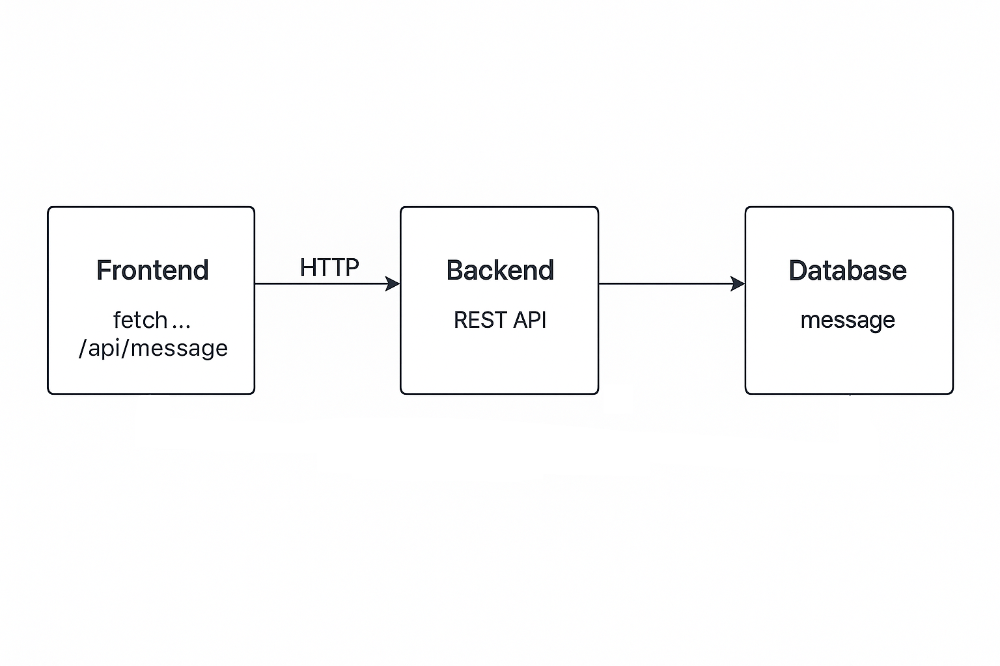
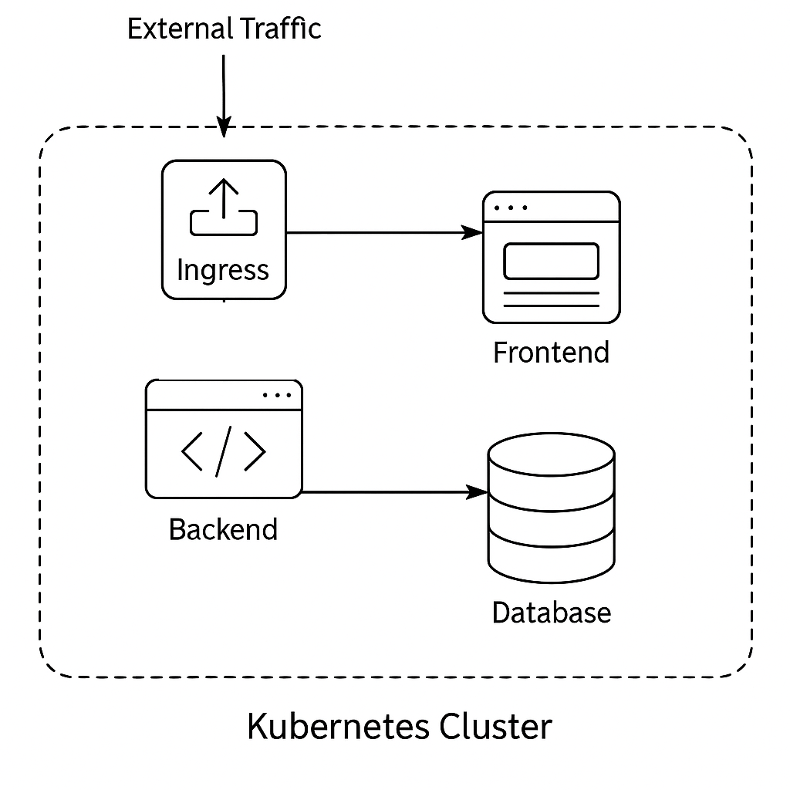

# KVInfoSysBund Minikube Demo (Full Stack)

This is a Kubernetes deployment of a full-stack sample application using **Minikube**. It includes:

- ✅ A real **frontend** served via NGINX
- ✅ A **Node.js backend** API connecting to Postgres
- ✅ A running **PostgreSQL** database
- ✅ Ingress routing for `/frontend` and `/api`

---

## 🧱 Architecture

---

## 🏗️ Infrastructure


## 📦 Components

| Component | Tech                  | Description                              |
|----------|------------------------|------------------------------------------|
| Frontend | HTML + JS + NGINX      | Calls `/api/message`                     |
| Backend  | Node.js + Express      | Connects to PostgreSQL                   |
| Database | PostgreSQL 15          | Responds with static SQL message         |
| Ingress  | Minikube + NGINX       | Routes traffic to services               |

---

## 🚀 Setup Instructions

### 1. Install Prerequisites

- [Docker](https://docs.docker.com/get-docker/)
- [kubectl](https://kubernetes.io/docs/tasks/tools/)
- [Minikube](https://minikube.sigs.k8s.io/docs/start/)

---

### 2. Start Minikube

```bash
minikube start --driver=docker
minikube addons enable ingress
```

---

### 3. Build and Push Docker Images (locally or to registry)

From project root:

```bash
# Frontend
docker build -t kvinfo/frontend ./frontend

# Backend
docker build -t kvinfo/backend ./backend
```

If using local Docker:
```bash
minikube image load kvinfo/frontend
minikube image load kvinfo/backend
```

---

### 4. Deploy Kubernetes Resources

```bash
kubectl apply -f k8s-manifests/
```

---

### 5. Set Local DNS for Ingress

```bash
echo "$(minikube ip) kvinfo.local" | sudo tee -a /etc/hosts
```

Then visit:
- 🔗 http://kvinfo.local/frontend
- 🔗 http://kvinfo.local/api/message

---

## 🧪 Teardown

```bash
./teardown.sh
```

---

## 📂 Project Structure

```
kvinfo-minikube-demo/
├── frontend/                 # Static React-like frontend
├── backend/                  # Express + PostgreSQL API
├── k8s-manifests/            # YAML manifests
├── .github/workflows/        # CI pipeline (optional)
├── setup.sh                  # One-command setup
├── teardown.sh               # One-command cleanup
└── README.md
```

---

## 🧠 Summary

This project demonstrates a real-world Kubernetes setup with frontend/backend/database communication, CI/CD potential, and full local deployability using Minikube.
