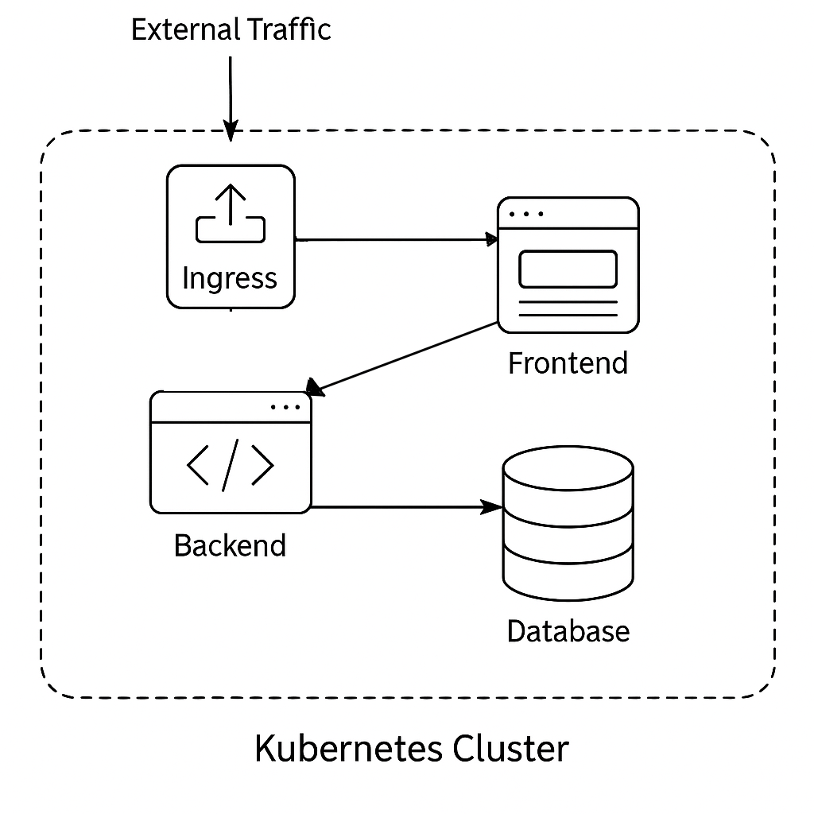

# Minikube Demo (Full Stack)

> This project demonstrates a full-stack application deployed and tested in a Kubernetes environment using Minikube. It
> includes automated setup/teardown scripts and a deployment structure that can be adapted for cloud environments like GKE
> or private Kubernetes clusters.


This is a Kubernetes deployment of a full-stack sample application using **Minikube**. It includes:

- ✅ A real **frontend** served via NGINX
- ✅ A **Node.js backend** API connecting to Postgres
- ✅ A running **PostgreSQL** database
- ✅ Ingress routing for `/frontend`

---


## 📂 Project Structure

```
kvinfo-minikube-demo/
├── frontend/                 # Static HTML + JS frontend
├── backend/                  # Express + PostgreSQL API
├── k8s-manifests/            # YAML manifests
├── .github/workflows/        # CI pipeline (optional)
├── setup.sh                  # One-command setup
├── teardown.sh               # One-command cleanup
└── README.md
```

## 🧱 Architecture


---

## 🏗️ Infrastructure



## 🔁 CI/CD Pipeline (Conceptual)

Although this project uses local scripts for simplicity, the same process can be CI/CD automated using GitHub Actions or
GitLab CI:

1. **Lint/Test** frontend and backend
2. **Build Docker images**
3. **Push to a registry (GHCR, Docker Hub)**
4. **Apply manifests using `kubectl` or ArgoCD**
5. **Verify rollout success via `kubectl wait`**

All manifests are reusable in any K8s environment with minimal changes.

## 📦 Components

| Component | Tech              | Description                        |
|-----------|-------------------|------------------------------------|
| Frontend  | HTML + JS + NGINX | Calls `/api/message`               |
| Backend   | Node.js + Express | Connects to PostgreSQL             |
| Database  | PostgreSQL 15     | Responds with static SQL message   |
| Ingress   | Minikube + NGINX  | Routes traffic to frontend service |

---

##  Setup Instructions

### 1. Install Prerequisites

- [Docker](https://docs.docker.com/get-docker/)
- [kubectl](https://kubernetes.io/docs/tasks/tools/)
- [Minikube](https://minikube.sigs.k8s.io/docs/start/)

---

### 2. Start Minikube

    ```bash
    minikube start --driver=docker
    minikube addons enable ingress
    
    ---

### 3. Build Docker Images Inside Minikube

From project root:

```bash
eval $(minikube docker-env)
docker build -t kvinfo/frontend ./frontend
docker build -t kvinfo/backend ./backend
```

---

### 4. Deploy Kubernetes Resources

```bash
kubectl apply -f k8s-manifests/
```

---

### 5.  Set Local DNS for Ingress

```bash
echo "$(minikube ip) kvinfo.local" | sudo tee -a /etc/hosts
```

Then visit:

- 🔗 http://kvinfo.local/frontend
- 🔗 http://kvinfo.local/api/message

---

##  Teardown

```bash
./teardown.sh
```

